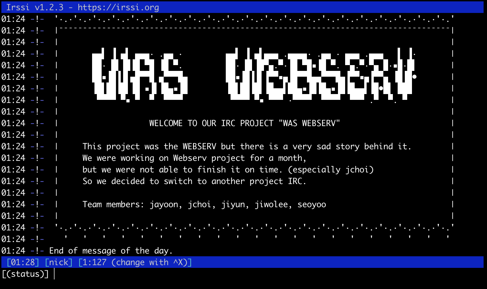
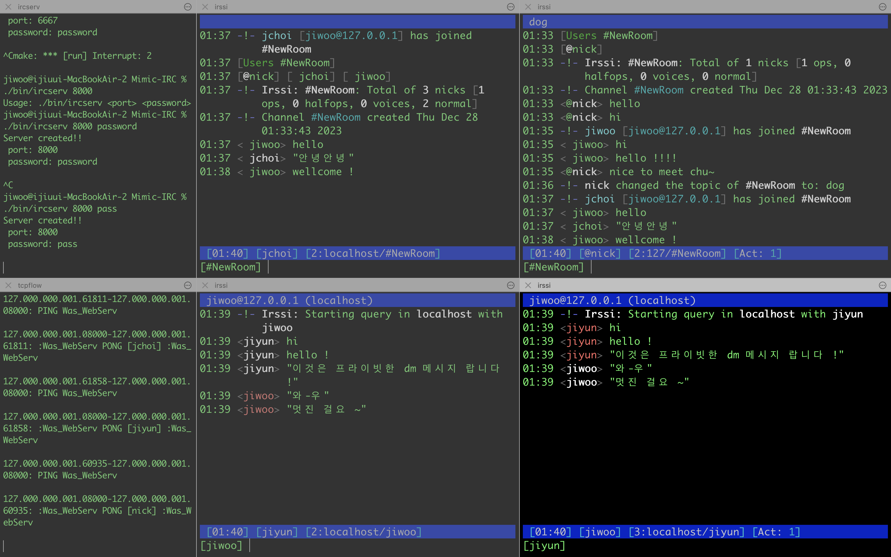
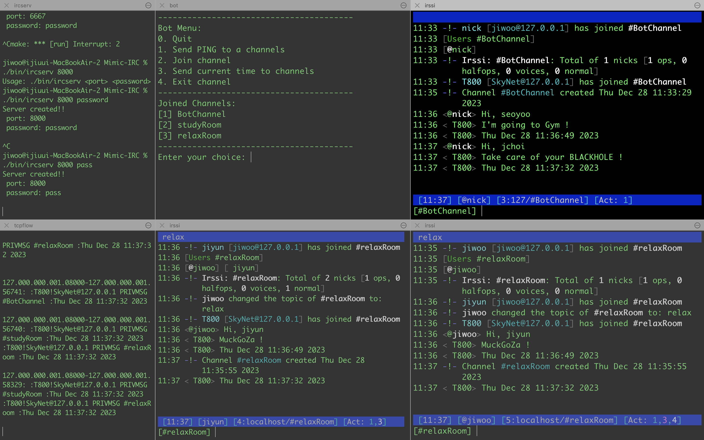
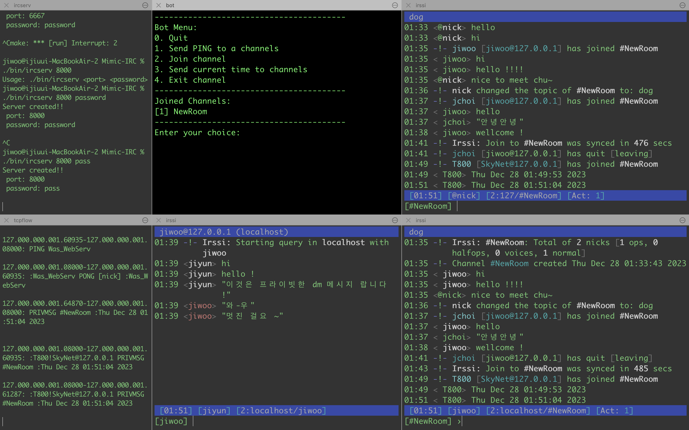
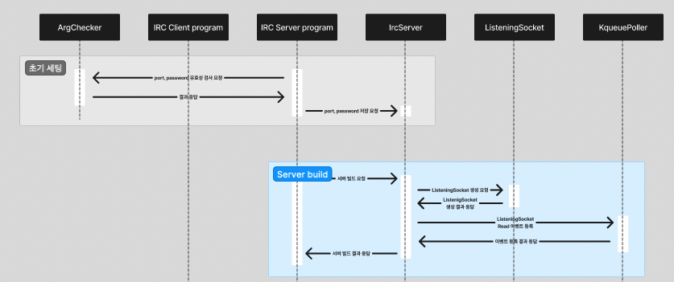
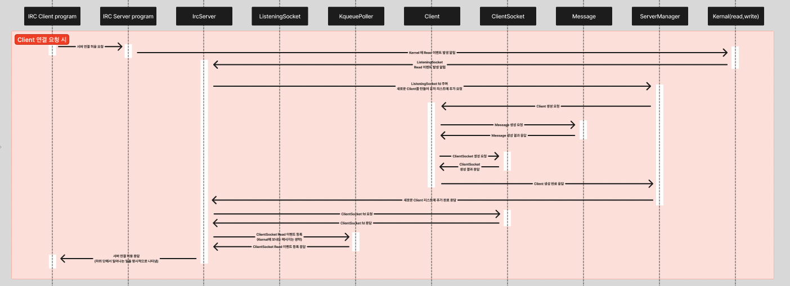

# irc readme.md

# Mimic-IRC

- [IRC 란?](#irc-란)
- [팀원](#팀원)
  - [수행한 역할 - jiwolee](#수행한-역할---jiwolee)
- [목표](#목표)
- [접근법](#접근법)
- [Mimic-irc 구현사항](#mimic-irc-구현사항)
- [Sequence Diagram](#sequence-diagram)
- [고민했던 점 & 공부한 것들](#고민했던-점--공부한-것들)
- [Mimic-irc 사용 및 테스트](#mimic-irc-사용-및-테스트)
- [참고자료](#참고자료)

## IRC 란?

IRC란 Internet Relay Chat의 약자로 실시간 인터넷 채팅 프로토콜이다. 클라이언트는 서버에 연결되어 채널을 개설 및 채팅이 가능하고, 서버는 부하 분산을 위해 트리구조로 이어져있는 다중 서버 간 메시지 전달(릴레이 기능)을 통해 안정적인 서비스를 제공한다.

우리는 3주간의 개발기간을 거쳐, IRC 프로토콜을 잘 준수하는 서버를 구현하는데 성공했다.

 irssi 클라이언트가 서버에 접속했을때 출력되는 화면

---
<!--
# 목차

- [팀원](https://github.com/jwo1024/Mimic-IRC#%ED%8C%80%EC%9B%90)
- [수행한 역할 - jiwolee](https://github.com/jwo1024/Mimic-IRC#%EC%88%98%ED%96%89%ED%95%9C-%EC%97%AD%ED%95%A0---jiwolee)
- [IRC](https://github.com/jwo1024/Mimic-IRC#irc)
- [Mimic-irc 사용 및 테스트](https://github.com/jwo1024/Mimic-IRC#mimic-irc-%EC%82%AC%EC%9A%A9-%EB%B0%8F-%ED%85%8C%EC%8A%A4%ED%8A%B8)
- [Mimic-irc 구현사항](https://github.com/jwo1024/Mimic-IRC#mimic-irc-%EA%B5%AC%ED%98%84%EC%82%AC%ED%95%AD)
-->
## 팀원

- jayoon, jchoi, **jiwolee**, jiyun, seoyoo

### 수행한 역할 - jiwolee

- kqueue-poller 관리
- client 요청 cmd 파싱
- IRC RFC 분석 및 프로토콜 cmd 구현
- bot 기능 추가
- 서버의 Wellcome-message 아스키아트 제작
- 수 많은 테스트..

# 목표

- Non-relay의 소규모 서버 : 다중 서버간 릴레이를 배제한, 단일 서버 기능만 제공하도록 구현
- I/O multiplexing : 단일 스레드/프로세스 상에서 다중 클라이언트에 대한 poller기반의 비동기처리를 지원
    - BSD 기반 시스템(우리의 경우 macOS)에서 활용 가능한, 보다 고성능인 kqueue를 poller로 사용
- IRC Protocol의 주요 명령어 기능 제공
    - connection registration : `PASS`, `NICK`, `USER`, `QUIT`
    - channel operator : `JOIN`, `PART`, `TOPIC`, `INVITE`, `KICK`, `PRIVMSG`, `MODE`
    - utils : `PONG`
- 서버 상에서 클라이언트와 동등하게 인식되는 chatting bot 프로그램 개발

## 접근법

1. [RFC 1459](https://datatracker.ietf.org/doc/html/rfc1459) - IRC 프로토콜에 관한 공식 문서를 읽으면서, 서버가 만족해야할 조건들을 개괄적으로 분석했다.
2. 권한 및 패키지 관련 이점을 위해 도커 위에 우분투 컨테이너를 올리고 테스트했다.
    1. `tcpflow`로 서버와 클라이언트가 tcp 패킷 상에서 실제로 주고받는 메시지를 모니터링했다. 
    2. `insplRCd` - 오픈 소스 IRC 서버를 실행하여 실제 반응하는 방식을 분석하였다.
    3. `irrsi` - 텍스트 기반 IRC 클라이언트 프로그램
    4. `nc` (netcat) - 기본적인 네트워킹 도구로, 보다 raw하게 클라이언트 역할을 테스트 할 수 있었다.
3. 1과 2번의 과정을 통해 우리가 만들고자 하는 서버가 제공해야하는 기능을 구체화할 수 있었다.

## Mimic-irc 구현사항

---
- C++ with OOP paradigm
- I/O Multiplexing
    - `kqueue` 사용
    - `socket`은 Non-block으로 설정
- 제공하는 프로토콜 Command
    - connection registration : `PASS`, `NICK`, `USER`, `QUIT`
    - channel operator : `JOIN`, `PART`, `TOPIC`, `INVITE`, `KICK`, `PRIVMSG`, `MODE`
    - utils : `PONG`
- 봇
    - 개별 클라이언트로서 작동함
    - 제공하는 프로토콜 Command`PRIVMSG`, `QUIT`, `PASS`, `NICK`, `USER`, `JOIN`, `PING`, `PONG`, `PART`
    - 원하는 채팅방에 입퇴장
    - 메시지 출력 기능사용자가 채팅방에 `"Hi, [jiyun | jchoi | jiwolee | seoyoo | jayoon]"`을 입력시 특정 메시지를 응답함
    - 채팅방에 현재시각 출력
<!-- 스샷이 좀 불분명하게 찍힌것 같다.-->

## Sequence Diagram

- 초기세팅 & Server build
  
- Client 연결 요청시
  
- [다이어그램 전체 구조설계](readme-img/다이어그램-전체_구조설계.png)

## 고민했던 점 & 공부한 것들

- 객체지향적 프로그래밍
    - 팀원들 모두 절차지향언어인 C언어로 프로그램을 작성하는데 익숙해져 있었기 때문에, 기존보다 규모가 큰 Mimic-irc를 구현하며 적용한 C++의 OOP 패러다임에 많은 낯설음을 느꼈다.
    - sequnece diagram을 작성하여, 구현 목표를 분명하게 했던 것이 많은 도움이 되었던 것 같다.
- I/O Multiplexing 애 대한 이해
    - 기본적인 에코서버 구현에서 출발하여 왜 I/O Multiplexing이 필요한지를 이해할 수 있었다.
        - I/O Multiplexing은 단일 프로세스에서 여러 입출력을 동시에 관리 하는 기술이다.
        - 소켓은 논블로킹으로 설정하고, 그에 대한 작업은 비동기적으로 처리하여 다중 작업을 수행하도록 구현하였다.
        - 어떤 **순서로** 받는지 → 동기, 비동기처리의 차이
        - **기다렸다** 받는지 → 블로킹, 논블로킹의 차리
    - 사용할 poller를(kqueue) 선정한 이후, 관련 API 사용방법을 정리해야 했다.
        - 통신 관련 코드는 대부분 C언어 라이브러리를 사용해서 C++ 스타일에 맞춰 작성하는데 조금 번거로움이 있었던 것 같다.
- 구현 범위 결정
    - irssi의 경우 tcp 메시지를 자동완성하고, 오기입을 일부 수정해주는 등 사용자 편의를 제공하고 있었는데 서버 관점에서도 이러한 사항들을 따라가야 하는지 사안마다 결정이 필요했다.
    - BOT을 구현하고 서버에서 테스트하면서, 오픈소스지만 실제로 사용되는 서버 프로그램인 insplRCd 에서도 segmentation fault가 발생하는 경우가 있었는데, 이와같은 ub들을 어디까지 처리해야하는지 결정해야 했다.
- 기타 애로사항
    - 프로젝트 진행 방식의 합의와 규칙이 없었기에, 작업의 확실한 모듈화를 원하는 팀원들과 전체 프로젝트의 진행을 파악하고 싶어 하는 팀원들 간의 동상이몽이 있었다.
    - 시간에 쫓긴다는 이유로 팀원들과 충분한 지식 나눔을 하지 못하여 지식 격차가 벌어졌다.
    - 위와 같은 이유로 기존 Webserv프로젝트를 중단하고 IRC 서버를 만드는 프로젝트로 변경하였다.   새롭게 시작하면서 좀더 명확한 역할 분배와 모두가 전체 흐름에 대해 이해할 수 있는 충분한 시간을 가지며 진행하려고 노력하였다.

## Mimic-irc 사용 및 테스트

Mimic-irc
- 기본 포트번호 `6667`
- 기본 패스워드 `password`

Mimic-irc 서버 실행하기
-  `make run`
- 포트번호나 패스워드 변경하고 싶다면 아래와 같이 실행   `./bin/ircserv <port> <password>`

BOT
- 기본 포트번호 `6667`
- 기본 패스워드 `password`

Bot 실행 (T800)
- `cd BOT`
- `make run`

- 포트번호 변경하기  
  `defines.hpp` 의 `kDefaultPort`,`kDefaultServerPort` 를 원하는 포트번호로 변경 후 `make run`
- 패스워드 변경하기  
`defines.hpp` 의 `kDefaultPassword`,`kDefaultServerPassword` 를 원하는 패스워드로 변경

클라이언트 프로그램 실행하기
- `irssi -c [ip주소] -p [포트번호] -n [닉네임]`
- `irssi -c 127.0.0.1 -p 6667 -n nickname`

- 클라이언트 프로그램안에서 채팅방 만들거나 참여하기   `/join [채팅방이름]`
- 클라이언트 프로그램안에서 dm 보내기   `/msg [상대닉네임] [메시지내용]`
- 클라이언트 프로그램안에서 채팅방 주제 설정하기    `/topic [주제]`
- 기타 등등.. 

참고한 IRC 실제 서버
- `inspircd --runasroot --nofork`
tcpflow
- `tcpflow -i lo port 6667 -c`
- `sudo tcpflow -i [네트워크 인터페이스] port [포트번호] -c`
- `ifconfig | grep LOOPBACK` 의 결과로 나오는 네트워크 인터페이스 감청(?)
- tcpflow 사용시 docker 사용했던 이유 → sudo 권한 필요해서

nc
- `nc -C 127.0.0.1 8080`
- `nc -C [ip주소] [포트번호]`

## 참고자료

- [irc 클라이언트 프로그램](https://irssi.org/support/irc/)
- [irc 서버 프로그램](https://docs.inspircd.org/3/configuration/#server)
- [IRC RFC 1459](https://datatracker.ietf.org/doc/html/rfc1459)
- [Modern irc](https://modern.ircdocs.horse/#user-message)
- [Command example](https://dd.ircdocs.horse/refs/commands/)
